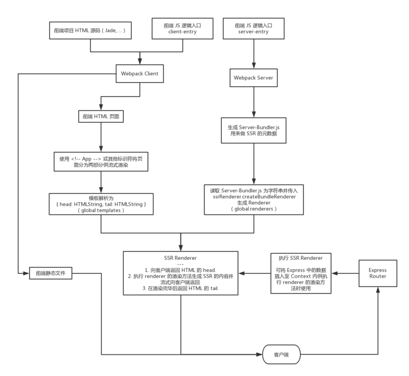
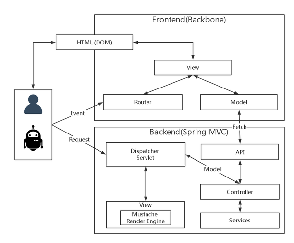

# VUE SSR 服务端渲染

少数既需要 SPA 强交互性，又对 SEO 和首屏速度有刚性需求的场景，这时候同构 SSR 就派上用场了。

管理平台，不需要做SEO

## 需求分析
1. 单页应用优势
单页应用(SPA)
改善用户体验。像APP一样流畅。

首屏渲染慢。
无法做seo。

服务端渲染是指，提前将页面在服务器端渲染好，当浏览器请求服务器时，直接返回渲染好的html页面返回。

Angular Universal 之于 Angular
 
Next.js 之于 React。

使用骨架屏（Skeleton Screen）来实现瞬间加载

Chrome 产品经理 Owen 写过一篇 Reactive Web Design: The secret to building web apps that feel amazing，谈到两种改进感知体验的手段：一是使用骨架屏（Skeleton Screen）来实现瞬间加载；二是预先定义好元素的尺寸来保证加载的稳定。跟我们的做法可以说不谋而合。

## 几个疑惑
1. 有了 node 后台做渲染，是不是不需要提供 API 的后台？
NO。虽然，使用 node 后台也能完成后台业务逻辑，如此一来，前后端又耦合严重。假设前端有变动，后台也得变，开发了移动都端 API 接口，PC 端无法复用。
所以，依然要做前后端分离。前端 + 渲染 Server + API Server

2. 

## 解决方法
1. 判断是蜘蛛访问时，使用服务器渲染

- 数据量大时，渲染时间长
- 保证数据真实性，Google可能就会认为你在作弊
2. 首页用服务端渲染，加载完成后交给前端，成为 SPA
多数时候搜索引擎都是依据Sitemap来进行索引的

我们就需要在JavaScript中赋予一些逻辑，我们还需要在Java在有同样的逻辑。维护两套逻辑。

## SSR 框架
[NUXT.js](https://nuxtjs.org/)

## 参考资料
[精读前后端渲染之争](https://github.com/camsong/blog/issues/8)
[vue 2.0服务端渲染从零开始](http://www.jianshu.com/p/e810cb90fc33)

[服务端与客户端同构 —— Vue.js 应用框架 Nuxt.js](https://www.w3ctech.com/topic/2067)

[饿了么的 PWA 升级实践](https://huangxuan.me/2017/07/12/upgrading-eleme-to-pwa/)