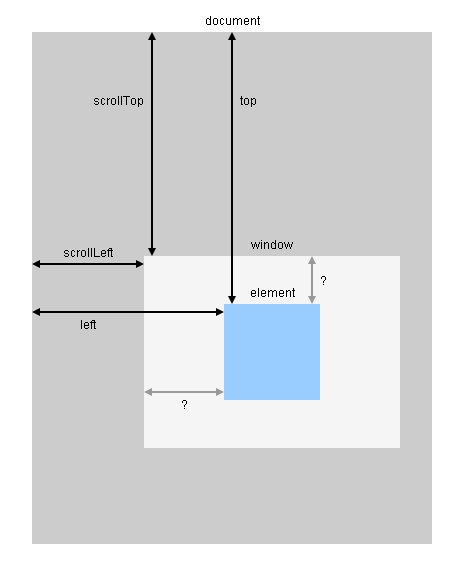

## 元素位置

### jQuery 获取DOM
Element.offset().top 距离顶部
Element.offset().left 距离左边

- [JQuery获取浏览器窗口的可视区域高度和宽度,滚动条高度](http://www.phpernote.com/jquery/946.html)
- [JS 获取浏览器窗口大小clientWidth、offsetWidth、scrollWidth](http://blog.sina.com.cn/s/blog_5d64f7e301017kh0.html)
- 距离浏览器窗口距离
```js
$('a[href=#OMG]')[0].getBoundingClientRect().top
```




### 滚动位置
```js
var sidebarScroll = $document.find('.J_sidebar_content').scrollTop() // 获取左栏滚动值


// 设定左边栏高度
function setSidebar(sidebarScroll) {
  var $sidebar = $document.find('.J_sidebar_content'),
      offsetTop = $sidebar.offset().top,
      windowHeight = $(window).height()

  $sidebar.css('height', windowHeight - offsetTop - 30 + 'px')
  if (sidebarScroll) {
    $sidebar.scrollTop(sidebarScroll)
  }
}
```

## 取数据data
$my_editor.attr('data-timestamp') //没有缓存
$my_editor.data('timestamp') // 有缓存

## 全屏
```js
/*
 * 进入全屏
 */
function toggleFullScreen() {
if ((document.fullScreenElement && document.fullScreenElement !== null) ||
 (!document.mozFullScreen && !document.webkitIsFullScreen)) {
  if (document.documentElement.requestFullScreen) {
    document.documentElement.requestFullScreen();
  } else if (document.documentElement.mozRequestFullScreen) {
    document.documentElement.mozRequestFullScreen();
  } else if (document.documentElement.webkitRequestFullScreen) {
    document.documentElement.webkitRequestFullScreen(Element.ALLOW_KEYBOARD_INPUT);
  }
} else {
  if (document.cancelFullScreen) {
    document.cancelFullScreen();
  } else if (document.mozCancelFullScreen) {
    document.mozCancelFullScreen();
  } else if (document.webkitCancelFullScreen) {
    document.webkitCancelFullScreen();
  }
}
}

// 启动全屏!
$document.on('keydown', function(e) {
 if (e.keyCode === 13) {
   e.preventDefault()
   console.log(e.keyCode)
   toggleFullScreen()
 }
})

$document.dblclick(function() {
 launchFullscreen(document.documentElement)
})
```
