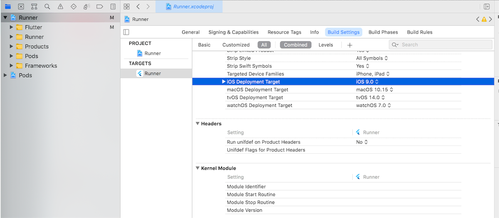
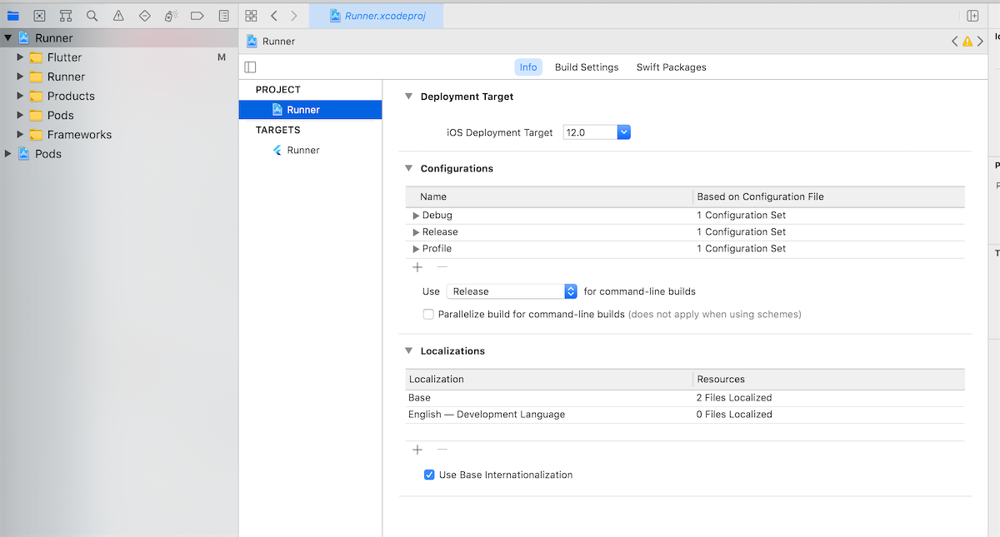
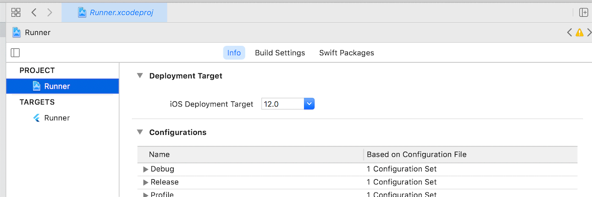

# 发布

## iOS

```
flutter build ios --release
```


配置好签名，Xcode 打开后，

product  -> Acrchive -> ad-hoc


## 获取 uuid

https://www.pgyer.com/tools/udid


## 提交测试遇到问题

::: danger ERROR
ERROR ITMS-90208: "Invalid Bundle. The bundle Runner.app/Frameworks/App.framework does not support the minimum OS Version specified in the Info.plist."
:::

After doing a `flutter clean`, changing **MinimumOSVersion** (inside /ios/Flutter/AppframeworkInfo.plist) to 9.0, **iOS Deployment Target** (inside **project** runner) to 9.0 and **iOS Deployment Target** (inside **target** runner) to 9.0 the error disappeared.







